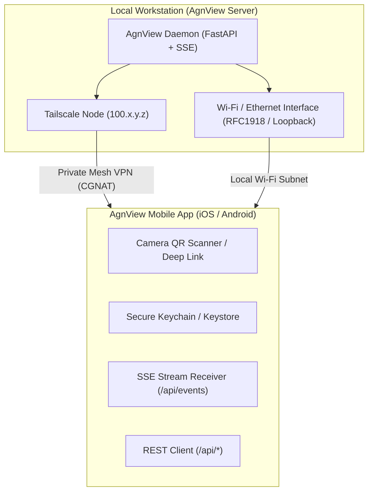

# AgnView Mobile Companion App Blueprint (iOS & Android)

This directory contains the architecture, OpenAPI schema, and native implementation blueprints for building the **AgnView Companion App** for **iOS (SwiftUI)** and **Android (Jetpack Compose / Kotlin)**.

The mobile app connects seamlessly to an AgnView server running on your local workstation, allowing you to monitor and control multi-agent builds, dispatch prompts to local CLI agents, and track AI subscription quotas from anywhere in the world.

---

## 1. Local-Only Connectivity Architecture

AgnView runs on the user's own local network. There is no external relay, no Cloudflare tunnel, and no cloud dependency:



### Connectivity Modes

1. **Local Wi-Fi (RFC1918 LAN)**:
   - AgnView discovers the workstation's local IPv4 (for example `192.0.2.x`).
   - Ultra-low latency pairing directly on the same local network.
   - Default bind is `127.0.0.1`; passing `--listen-lan` binds to `0.0.0.0` for local network access. Public interfaces are strictly refused.

2. **Private Mesh VPN (Tailscale)**:
   - If Tailscale is running on both the workstation and mobile client, AgnView detects the `100.64.0.0/10` CGNAT IP.
   - Encrypted peer-to-peer connection without exposing ports to the public internet.

---

## 2. Pairing Protocol & QR Specification (v1)

Pairing between the workstation and mobile device is conducted via local QR code scan conforming to `docs/PAIRING.md`.

### QR Payload v1

The QR code encodes a canonical `agnview://pair` URI:

```
agnview://pair?v=1&name=<machine_name>&lan=<rfc1918_address>:<port>&fp=<sha256_cert_fingerprint>&id=<pair_id>&k=<key>
```

- **pair_id**: 16 bytes from a CSPRNG (base64url).
- **k**: 32 bytes from a CSPRNG (base64url). Never leaves the QR pixels and the two paired devices. Stored on the hub at mode `0600` under `~/.agnview/pairing_token`.
- **fp**: SHA-256 fingerprint (hex) of the hub self-signed TLS certificate generated on first run.
- A **Regenerate** action immediately invalidates every paired device.

### Authentication Header
All REST and SSE requests from the mobile app must include the pairing token in the HTTP headers:

```http
X-AgnView-Token: <PAIRING_TOKEN>
```
*(Or alternatively: `Authorization: Bearer <PAIRING_TOKEN>`)*

---

## 3. Core Mobile App Features

### Screen 1: Unified Live Multi-Agent Console
- Real-time terminal output streamed via Server-Sent Events (`/api/events`).
- Filter tabs: **All**, **Codex**, **AntiGravity**, **Claude Code**, **System**.
- Terminal aesthetic: Dark background (`#06090e`), monospace font (JetBrains Mono / SF Mono), colored tags for each agent.
- Quick prompt dispatch bar at the bottom: select target agent from the five known agent roles (`claude_code`, `codex`, `antigravity`, `deepseek`, `custom`) and type prompts sent to `POST /api/console/dispatch`.

### Screen 2: Pipelines & Task Orchestration
- Active and past pipelines listed with status (`running`, `completed`, `failed`).
- Task list showing each task's dependencies (e.g. Task A -> Task B -> Task C). This is a list, not a graph canvas.
- Per-task output summaries and exit codes.
- **Defect Revision Sheet**: When Claude Code or human operator identifies a defect in an upstream task, tap "Request Revision" to send defect instructions directly to Codex or AntiGravity (`POST /api/tasks/{task_id}/request-revision`).

### Screen 3: Live AI Subscription Quotas
- Subscription cards for **Claude Pro**, **ChatGPT Plus/Team**, and **Gemini Advanced**.
- Visual progress bars for token usage, message caps, and cost limits.
- Configurable auto-refresh interval (1 min, 5 min, 15 min, or Manual).
- Pull-to-refresh to trigger immediate live quota probe (`POST /api/usage/refresh-all`).

---

## 4. iOS Implementation (SwiftUI)

### 4.1 Deep Link Handling (`AgnViewApp.swift`)

```swift
import SwiftUI

@main
struct AgnViewApp: App {
    @StateObject private var gateway = AgnViewGatewayClient()

    var body: some Scene {
        WindowGroup {
            ContentView()
                .environmentObject(gateway)
                .onOpenURL { url in
                    handleDeepLink(url)
                }
        }
    }

    private func handleDeepLink(_ url: URL) {
        guard url.scheme == "agnview", url.host == "pair" else { return }
        let components = URLComponents(url: url, resolvingAgainstBaseURL: false)
        let serverUrl = components?.queryItems?.first(where: { $0.name == "url" })?.value
        let token = components?.queryItems?.first(where: { $0.name == "token" })?.value

        if let serverUrl = serverUrl, let token = token {
            gateway.pair(url: serverUrl, token: token)
        }
    }
}
```

### 4.2 Gateway Networking & SSE Client (`AgnViewGatewayClient.swift`)

```swift
import Foundation
import Combine

class AgnViewGatewayClient: ObservableObject {
    @Published var isConnected: Bool = false
    @Published var logs: [ConsoleEntry] = []
    @Published var accounts: [UsageAccount] = []

    private var serverUrl: String = ""
    private var pairingToken: String = ""
    private var sseTask: URLSessionDataTask?

    func pair(url: String, token: String) {
        self.serverUrl = url
        self.pairingToken = token
        // Save token to iOS Keychain
        KeychainHelper.save(key: "agnview_token", value: token)
        KeychainHelper.save(key: "agnview_url", value: url)
        
        testConnection()
        startSSE()
    }

    func testConnection() {
        guard let url = URL(string: "\(serverUrl)/api/mobile/status") else { return }
        var request = URLRequest(url: url)
        request.setValue(pairingToken, forHTTPHeaderField: "X-AgnView-Token")

        URLSession.shared.dataTask(with: request) { [weak self] data, response, error in
            DispatchQueue.main.async {
                if let http = response as? HTTPURLResponse, http.statusCode == 200 {
                    self?.isConnected = true
                }
            }
        }.resume()
    }

    func startSSE() {
        guard let url = URL(string: "\(serverUrl)/api/events") else { return }
        var request = URLRequest(url: url)
        request.setValue(pairingToken, forHTTPHeaderField: "X-AgnView-Token")
        request.timeoutInterval = 3600 // Keep open

        // Use URLSession with URLSessionDataDelegate or LDSwiftEventSource
        // to stream 'agent_output_chunk' and 'task_completed' events.
    }

    func dispatchCommand(agent: String, prompt: String) {
        guard let url = URL(string: "\(serverUrl)/api/console/dispatch") else { return }
        var request = URLRequest(url: url)
        request.httpMethod = "POST"
        request.setValue("application/json", forHTTPHeaderField: "Content-Type")
        request.setValue(pairingToken, forHTTPHeaderField: "X-AgnView-Token")

        let body: [String: Any] = ["target_agent": agent, "prompt": prompt]
        request.httpBody = try? JSONSerialization.data(withJSONObject: body)

        URLSession.shared.dataTask(with: request).resume()
    }
}
```

### 4.3 iOS App Transport Security (Info.plist)
If testing local IP connections (`http://192.0.2.x`), add local network ATS exception:

```xml
<key>NSAppTransportSecurity</key>
<dict>
    <key>NSAllowsLocalNetworking</key>
    <true/>
</dict>
<key>NSCameraUsageDescription</key>
<string>AgnView uses the camera to scan the server pairing QR code.</string>
<key>CFBundleURLTypes</key>
<array>
    <dict>
        <key>CFBundleURLSchemes</key>
        <array>
            <string>agnview</string>
        </array>
    </dict>
</array>
```

---

## 5. Android Implementation (Kotlin & Jetpack Compose)

### 5.1 Deep Link Intent Filter (`AndroidManifest.xml`)

```xml
<activity
    android:name=".MainActivity"
    android:exported="true">
    
    <!-- Standard Launcher -->
    <intent-filter>
        <action android:name="android.intent.action.MAIN" />
        <category android:name="android.intent.category.LAUNCHER" />
    </intent-filter>

    <!-- Deep Link agnview://connect -->
    <intent-filter>
        <action android:name="android.intent.action.VIEW" />
        <category android:name="android.intent.category.DEFAULT" />
        <category android:name="android.intent.category.BROWSABLE" />
        <data android:scheme="agnview" android:host="connect" />
    </intent-filter>
</activity>
```

### 5.2 Deep Link Intent Handling (`MainActivity.kt`)

```kotlin
class MainActivity : ComponentActivity() {
    private val viewModel: AgnViewViewModel by viewModels()

    override fun onCreate(savedInstanceState: Bundle?) {
        super.onCreate(savedInstanceState)
        handleIntent(intent)
        
        setContent {
            AgnViewTheme {
                MainScreen(viewModel)
            }
        }
    }

    override fun onNewIntent(intent: Intent) {
        super.onNewIntent(intent)
        handleIntent(intent)
    }

    private fun handleIntent(intent: Intent?) {
        val uri = intent?.data ?: return
        if (uri.scheme == "agnview" && uri.host == "connect") {
            val serverUrl = uri.getQueryParameter("url")
            val token = uri.getQueryParameter("token")
            if (serverUrl != null && token != null) {
                viewModel.pair(serverUrl, token)
            }
        }
    }
}
```

### 5.3 OkHttp Server-Sent Events (SSE) Client

```kotlin
import okhttp3.*
import okhttp3.sse.*

class AgnViewRepository(private val client: OkHttpClient) {
    private var sseClient: EventSource? = null

    fun connectSSE(baseUrl: String, token: String, listener: EventSourceListener) {
        val request = Request.Builder()
            .url("$baseUrl/api/events")
            .header("X-AgnView-Token", token)
            .build()

        val factory = EventSources.createFactory(client)
        sseClient = factory.newEventSource(request, listener)
    }

    fun dispatchCommand(baseUrl: String, token: String, agent: String, prompt: String, callback: Callback) {
        val json = """{"target_agent":"$agent","prompt":"$prompt"}"""
        val body = RequestBody.create(MediaType.parse("application/json"), json)
        val request = Request.Builder()
            .url("$baseUrl/api/console/dispatch")
            .header("X-AgnView-Token", token)
            .post(body)
            .build()

        client.newCall(request).enqueue(callback)
    }
}
```

---

## 6. App Icon & Graphic Asset Specifications

The complete AgnView brand and app icon asset suite is prepared in `../assets/` and integrated into the native Xcode asset catalog at `ios/AgnView/Assets.xcassets/AppIcon.appiconset`:

### Production Asset Suite (`../assets/`)
- **`agnview-app-icon-dark.png`** (`1254 x 1254 px`, RGB): iOS primary app icon squircle with dark frosted glass finish and subtle glossy rim.
- **`agnview-app-icon-light.png`** (`1254 x 1254 px`, RGB): iOS alternate light mode app icon squircle.
- **`agnview-icon.png`** (`1254 x 1254 px`, RGBA): Transparent high-resolution multi-agent hub emblem (central chip with 4 agent node branches).
- **`agnview-icon-outlined.png`** (`1254 x 1254 px`, RGBA): Outlined high-contrast hub emblem for light themes.
- **`agnview-logo-dark.png`** (`2172 x 724 px`, RGBA): Horizontal brand lockup with white text for dark mode interfaces.
- **`agnview-logo-light.png`** (`2172 x 724 px`, RGBA): Horizontal brand lockup with dark text for light mode interfaces.
- **`agnview-banner-dark.png` & `agnview-banner-light.png`** (`1672 x 941 px`, RGB): Hero banners with tagline *"AI multi-agent orchestration hub"*.

### iOS App Icon Asset Catalog (`ios/AgnView/Assets.xcassets`)
- Configured with `Contents.json` supporting Universal iOS 1024x1024 icons, dark mode appearance overrides, and tinted app icons.
- **App Store Icon**: `1024 x 1024 px` (PNG, 24-bit RGB, no alpha channel).
- **iPhone Notification**: `40 x 40 px` (@2x) and `60 x 60 px` (@3x).
- **iPhone Settings**: `58 x 58 px` (@2x) and `87 x 87 px` (@3x).
- **iPhone Spotlight**: `80 x 80 px` (@2x) and `120 x 120 px` (@3x).
- **iPhone App Icon**: `120 x 120 px` (@2x) and `180 x 180 px` (@3x).
- **iPad App Icon**: `152 x 152 px` and `167 x 167 px` (iPad Pro).

### Android Adaptive Icon Specifications (`res/mipmap-*`)
- **Google Play Store Artwork**: `512 x 512 px` (PNG, 32-bit).
- **Adaptive Icon Foreground (`ic_launcher_foreground.png`)**: `432 x 432 px` canvas with safe graphic zone centered within `264 x 264 px`.
- **Adaptive Icon Background (`ic_launcher_background.png`)**: Dark slate canvas (`#080c10`) with radial cyan gradient.
- **Density buckets**:
  - `mdpi`: 48 x 48 px
  - `hdpi`: 72 x 72 px
  - `xhdpi`: 96 x 96 px
  - `xxhdpi`: 144 x 144 px
  - `xxxhdpi`: 192 x 192 px

---

## 7. Machine-Readable OpenAPI Contract

Refer to `docs/mobile-api-spec.json` in [github.com/tlaskar-git/AgnView](https://github.com/tlaskar-git/AgnView) for the complete OpenAPI 3.1.0 and SSE event stream specification, including sample payloads for code generation tools like `openapi-generator` or `swift-openapi-generator`.

---

## Revision 2026-09-25 (design review)

This section overrides any earlier statement in this document that conflicts with it.

- Pairing is by QR scan only. The app accepts the `agnview://` payload in versions v1 and v2. There is no typed URL and no token entry.
- One phone can hold several hubs. Hubs are stored on the phone only ("client only"). "Remove from this phone" deletes the local entry and does not revoke the key on the hub.
- Connection routes are LAN, Direct, Relay and Offline, as defined by the hub's pairing document. The sample deep link handler in section 4 is illustrative only and does not define the payload.
- Screens are Console, Sessions, Pipelines, Usage and Settings.
- Error states are hub offline, auth failed, key revoked and relay only.
- Usage shows only the providers the hub reports (claude, chatgpt, gemini). Each card shows tokens, cost, requests and the age of the last reading.
- DeepSeek is an agent in Console. It has no usage card.
- The Sessions endpoint is unconfirmed on the hub.
